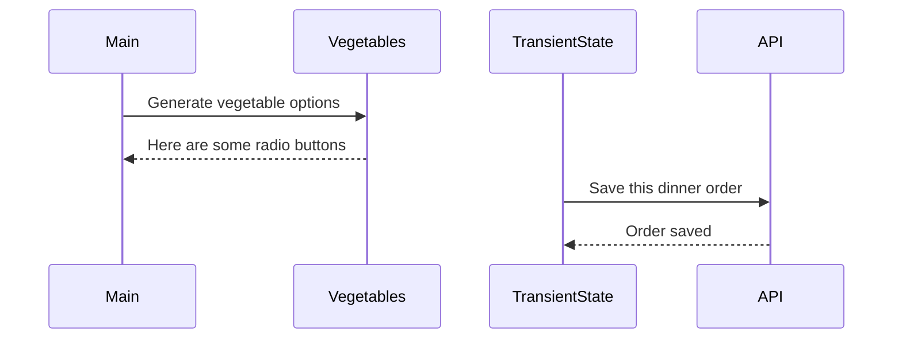

# Events and State Self-Assessment

> 🧨 Make sure you answer the vocabulary and understanding questions at the end of this document before notifying your coaches that you are done with the project

## Setup

1. Make sure you are in your `workspace` directory
1. `git clone {github repo SSH string}`
1. `cd` into the directory it creates
1. `code .` to open the project code
1. Use the `serve` command to start the web server
1. Open the URL provided in Chrome

## Requirements

### Initial Render

1. All 10 base dishes should be displayed as radio input options.
1. All 9 vegetables should be displayed as radio input options.
1. All 6 side dishes should be displayed as radio input options.
1. All previously purchases meals should be displayed below the meal options. Each purchase should display the primary key and the total cost of the purcahsed meal.

### State Management

1. When the user selects an item in any of the three columns, the choice should be stored as transient state.
1. When a user makes a choice for all three kinds of food, and then clicks the "Purchase Combo" button, a new sales object should be...
   1. Stored as permanent state in your local API.
   1. Represented as HTML below the **Monthly Sales** header in the following format **_exactly_**. Your output will not have zeroes, but the actual amount.
      ```html
      Receipt #1 = $00.00
      ```
   1. The user's choices should be cleared from transient state once the purchase is made.

## Design

Given the description and animation above...

1. Create an ERD for this application before you begin.
   > in-project
1. Make a list of what modules need to be created to make your application as modular as possible. Create a **Dependency Graph** for the project to be reviewed once you are complete with the assessment.
   > External miro page: https://miro.com/welcomeonboard/YmdhVVl5NWxMVXZWSHZSNHNsTUVIWW1VNU5vaFcyRDJ6SUY5SEdlR1VqeTFGS3Y0YjVuUkhTYlN4WndXV3BvR3wzNDU4NzY0NjAwNTIxOTA5NjU2fDI=?share_link_id=538051504135
1. Create a **Sequence Diagram** that visualizes what your algorithm is for this project. We'll give you a minimal starting point.
   > made on sequencediagram.org, needs updates to match the final function names I chose but the logic of the project's control flow is highly consistent. You can re-create it by pasting the following logic into the site's shell:
   > title <size:35> <color #navy> **House of Hummus**

entryspacing 0.4

frame #wheat Sequence Diagram: Self Assesment 4

participantgroup #grey \*\*scripts

participant main.js
participant dishes.js
participant vegetables.js
participant sideDishes.js
participant transientState.js
participant sales.js

end

participantgroup #orange API

participant database.json

end

note over main.js:renders UI, \n initiates data fetches, \n handles button clicks
note over dishes.js:provides available dish options, \n such as hummus flavors
note over vegetables.js:provides vegetable choices, \n such as cucumber or carrots
note over sideDishes.js:provides available side dishes
note over transientState.js: holds the dish, vegetable, \n and side dish selections temporarily
note over database.json:handles data persistence \n and saves the order to\n the database
note over sales.js: displays purchase receipts, \n including total price

main.js-#blue>dishes.js: getDishOptions()
dishes.js--#blue>main.js:return dish options

main.js-#red>vegetables.js: getVegetableOptions()
vegetables.js--#red>main.js:return vegetable options

main.js-#green>sideDishes.js: getSideDishOptions()
sideDishes.js--#green>main.js:return side dish options

loop #indigo
main.js->main.js:Render dish, vegetable, and sideDish options
end

dishes.js-#lightblue>transientState.js: storeDishSelection(dish)
transientState.js--#lightblue>dishes.js:return dish selection data

vegetables.js-#pink>transientState.js: storeVegetableSelection(vegetable)
transientState.js--#pink>vegetables.js: Vegetable selection stored

sideDishes.js-#lightgreen>transientState.js:storeSideDishSelection(side_dish)
transientState.js--#lightgreen>sideDishes.js:Side dish selection stored

main.js-#white>transientState.js: getSelections()

transientState.js--#white>main.js:return dish, vegetable, side dish selection

main.js-#orange>database.json:saveOrder({dish, vegetable, side_dish})
database.json--#orange>main.js:Order saved, return receipt id and price

main.js->sales.js: displayReceipt(receipt_id, price)
sales.js-->main.js: Receipt rendered

main.js-#wheat>transientState.js: clearSelections()
transientState.js--#wheat>main.js: Selections cleared



## Vocabulary and Understanding

> 🧨 Before you click the "Assessment Complete" button on the Learning Platform, add your answers below for each question and make a commit. It is your option to request a face-to-face meeting with a coach for a vocabulary review.

1. Should transient state be represented in a database diagram? Why, or why not?

   > No, transient state does not need to be represented in a database diagram because its purpose is simply to hold all of the temporary application data present when the user interacts with the app. Since it is cleared immediately after a transaction, and does not remain in permanent storage, it can remain absent from a database diagram.

2. In the **FoodTruck** module, you are **await**ing the invocataion of all of the component functions _(e.g. sales, veggie options, etc.)_. Why must you use the `await` keyword there? Explain what happens if you remove it.

   > The "await" statement is a keyword often used in asynchronous functions to wait for a given API function call before executing the remaining code of the function. If the "await" keyword were removed, the program would execute entirely before receiving the necessary information from the API, causing purchases to never be saved correctly, or the UI not to update in response to user choices.
   > // distinguish between immidiate and later returns

3. When the user is making choices by selecting radio buttons, explain how that data is retained so that the **Purchase Combo** button works correctly.

   > When the user makes their selections using the radio buttons for entrees, sides, and vegetables, each of these selections are stored in the following functions in transientState.js; getSideSelection(), getEntreeSelection(), and getVegetableSelection(). These accessor functions are responsible for retrieving the stored food object ids from storeSelectedSide(), storeSelectedEntree(), and storeSelectedVegetable() [which temporarily hold the user's food object selections after their respective eventListener captures the relevant object ids]. In order to make the purchase, the accessor functions then retrive the stored food object selections once the "Purchase Combo" button is clicked.

4. You used the `map()` array method in the self assessment _(at least, you should have since it is a learning objective)_. Explain why that function is helpful as a replacement for a `for..of` loop.

   > The map() or filter() function is helpful as a replacement for a for...of loop --when array filtering is necessary-- for two main reasons. Firstly, it is a far more efficient way of setting up an array filtering function with whatever logic is necessary, and automatically returning a new filtered array, as opposed to creating an empty array in a for...of loop that objects are pushed into during the function's execution. Secondly, this function produces a transformed array of the same length as the original that is both easier to modify and works better as a return value for rendering HTML elements.
